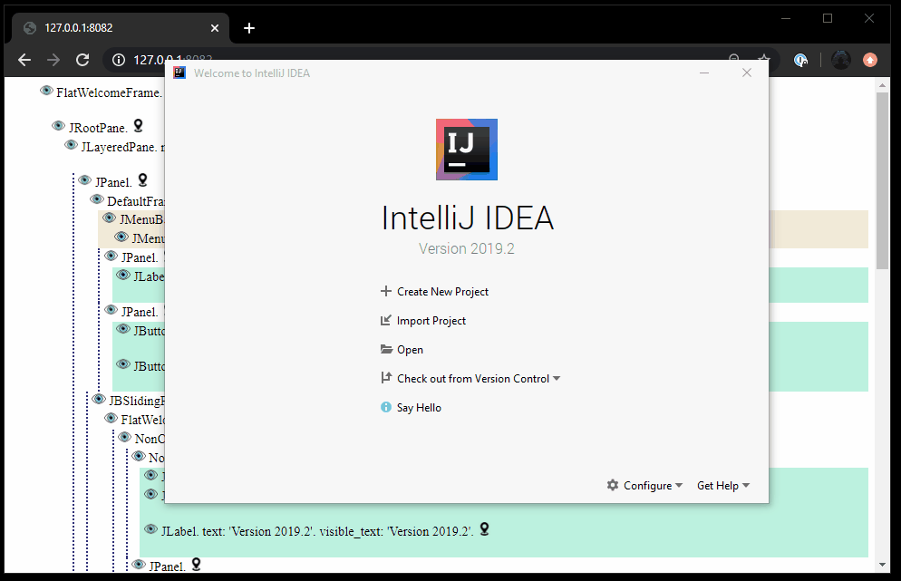

## Quick start
Fist we need to launch Ide. Since `runIdeForUiTests` task is blocking, we can run it as an asynchronous process.

`./gradlew ui-test-example:clean ui-test-example:runIdeForUiTests &`
 
Next we can start the tests. Because of this is local run, you must be sure welcome frame is visible on the screen. 

`./gradlew ui-test-example:test`

Or just run all together with one line

`./gradlew ui-test-example:clean ui-test-example:runIdeForUiTests & ./gradlew ui-test-example:test`

## Remote-robot
Remote-robot library inspired by Selenium WebDriver. It supports ideas since `2018.3`.


It consists of `remote-robot` client and `robot-server` plugin.

`remote-robot` - is a client(test) side library used to send commands to the `robot-server` plugin. 

`robot-server` - is an Idea plugin which should be ran with the plugin you are developing. 
The easiest way to do it is to execute `runIdeForUiTests` task. When Idea initialized, `robot-server` starts listening for commands from UI test to execute.

`remote-robot` communicates with the `robot-server` via HTTP protocol, that`s mean you can launch the Idea on remote machines or docker containers to check you plugin with different test environments.

### Setup
In the test project:
```groovy
dependencies {
    testImplementation("com.intellij.remoterobot:remote-robot:REMOTER-ROBOT_VERSION")
}
```
In the plugin project:
```groovy
downloadRobotServerPlugin.version = REMOTER-ROBOT_VERSION

runIdeForUiTests {
    systemProperty "robot-server.port", "8082"
}
```
Of course, you can have all in one project. 
### Create Remote-robot
In test project:
```java
RemoteRobot remoteRobot = new RemoteRobot("http://127.0.0.1:8082");
```
### Searching components
We use [`XPath`](https://www.w3.org/TR/xpath-21/) query language to find components.
Once Idea with `robot-server` started, you can open `http://ROBOT-SERVER:PORT` [link](http://127.0.0.1:8082).
The page represent idea components hierarchy in HTML format. You can find the component you interesting in and write an XPath to it like we usually do with Selenium WebDriver.
There is also a simple XPath generator which can help write and test your XPaths.


Define locator
```java
Locator loginToGitHubLocator = byXpath("//div[@class='MainButton' and @text='Log in to GitHub...']");
```
Find one component
```java
ComponentFixture loginToGitHub = remoteRobot.find(ComponentFixture.class, loginToGitHubLocator);
```
Find many components
```java
List<ContainterFixture> dialogs = remoteRobot.findAll(
    ComponentFixture.class, 
    byXpath("//div[@class='MyDialog']")
);
```
### Fixtures
Fixtures introduce `Page Object Pattern`. 
There are two basic fixtures:
- `ComponentFixture` is the simplest representation of a real any component with basic methods;
- `ContainerFixture` extends `ComponentFixture` and allows search other components inside it. 

You can create your own fixtures:
```java
@DefaultXpath(by = "FlatWelcomeFrame type", xpath = "//div[@class='FlatWelcomeFrame']")
@FixtureName(name = "Welcome Frame")
public class WelcomeFrameFixture extends ContainerFixture {
    public WelcomeFrameFixture(@NotNull RemoteRobot remoteRobot, @NotNull RemoteComponent remoteComponent) {
        super(remoteRobot, remoteComponent);
    }

    // Create New Project 
    public ComponentFixture createNewProjectLink() {
        return find(ComponentFixture.class, byXpath("//div[@text='Create New Project' and @class='ActionLink']"));
    }

    // Import Project
    public ComponentFixture importProjectLink() {
        return find(ComponentFixture.class, byXpath("//div[@text='Import Project' and @class='ActionLink']"));
    }
}
```
```java
// find custom fixture by its default xpath
WelcomeFrameFixture welcomeFrame = remoteRobot.find(WelcomeFrameFixture.class);
welcomeFrame.createNewProjectLink().click();
```
### Get data from real component. Executing code.
We use JavaScript [`rhino`](https://github.com/mozilla/rhino) engine to work with components on Idea side.

Example of retrieving text from ActionLink component:
```java
public class ActionLinkFixture extends ComponentFixture {
    public ActionLinkFixture(@NotNull RemoteRobot remoteRobot, @NotNull RemoteComponent remoteComponent) {
        super(remoteRobot, remoteComponent);
    }
    
    public String text() {
        return callJs("component.getText();");
    }
}
```
We can retrieve data via `RemoteRobot` with `callJs` method. In this case there is a `robot` var in context of JavaScript execution. 
The `robot` is instance of extended class of  [`org.assertj.swing.core.Robot`](https://joel-costigliola.github.io/assertj/swing/api/org/assertj/swing/core/Robot.html) 

If you call `callJs` method from `fixture` object you will also have in the context `component` var which is the real component you found early.

`runJs` method works the same way without any return value:
```java
public void click() {
        runJs("const offset = component.getHeight()/2;" +
                "robot.click(" +
                "component, " +
                "new Point(offset, offset), " +
                "MouseButton.LEFT_BUTTON, 1);"
        );
    }
```

We import some packages to the context before the script executed.
```java
    java.awt
    org.assertj.swing.core
    org.assertj.swing.fixture
```
You can add other packages or classes with js [methods](https://www-archive.mozilla.org/rhino/apidocs/org/mozilla/javascript/importertoplevel).
```java
    importClass(java.io.File);            
    importPackage(java.io);
```
Or just use the full path.

```java
    Boolean isDumbMode = ideaFtame.retrieve(
        "com.intellij.openapi.project.DumbService.isDumb(component.project);"
    );
```

### Text
Sometimes you may don't want to dig the whole component to find out which field contains the text you need to reach. 
If you just need to check whether some text is present on the component, or you just need to click at the text, 
you can use `fixture` methods:
```java
welcomeFrame.findText("Create New Project").click();

assert(welcomeFrame.hasText(startsWith("Version 20")));

List<String> renderedText = welcomeFrame.findAllText()
    .stream()
    .map(RemoteText::getText)
    .collect(Collectors.toList());
```
Instead of looking for text inside the component structure we just render it on a fake `Graphics` to collect texts data and its points.

### Kotlin
If you already familiar with Kotlin please take a look at [kotlin example](/examples/ui-test-example/src/test/kotlin/org/intellij/examples/simple/plugin/CreateCommandLineKotlinTest.kt). You can find it easier to read and use.
### Steps logging
We use `step` wrapper method to make test log easy to read. In the example simple `StepLogger` is used to show how useful it may be. 
By implementing your own `StepProcessor` you can extend steps flow, connect [allure report](https://docs.qameta.io/allure/) for instance.