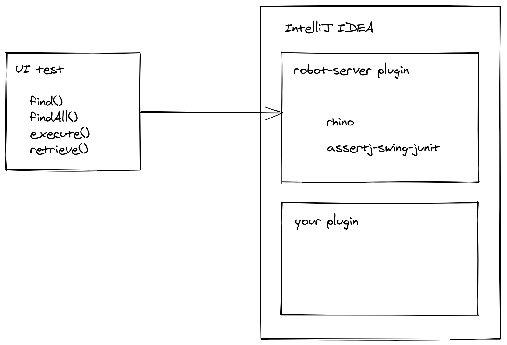
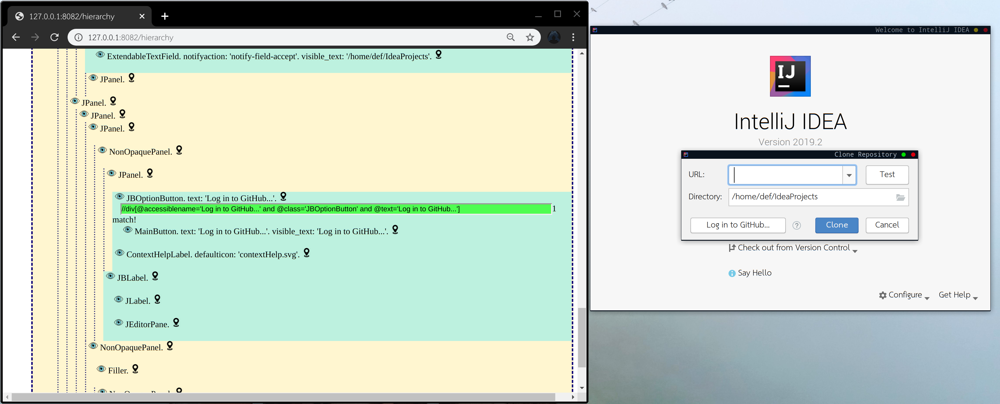

## Quick start
Fist we need to launch Ide. Since `runIdeForUiTests` task is blocking, we can run it asynchronously.

`./gradlew ui-test-example:clean ui-test-example:runIdeForUiTests &`
 
Next we can start the tests. Because of this is local run, you must be sure welcome frame is visible on the screen. 

`./gradlew ui-test-example:test`

Or just run all together with one line

`./gradlew ui-test-example:clean ui-test-example:runIdeForUiTests & ./gradlew ui-test-example:test`

## Remote-robot
Remote-robot library inspired by Selenium WebDriver.



It consists of `remote-robot` client and `robot-server` plugin.

`remote-robot` - is a client(test) side library used to send commands to the `robot-server` plugin. 

`robot-server` - is an Idea plugin which should be ran with the plugin you are developing. 
The easiest way to do it is to execute `runIdeForUiTests` task. When Idea initialized, `robot-server` starts listening for commands from UI test to execute.

`remote-robot` communicates with the `robot-server` via HTTP protocol, that`s mean you can launch the Idea on remote machines or docker containers to check you plugin with different test environments.

### Setup
In test project:
```groovy
dependencies {
    testImplementation("org.jetbrains.test:remote-robot:REMOTER-ROBOT_VERSION")
}
```
In plugin project:
```groovy
downloadRobotServerPlugin.version = REMOTER-ROBOT_VERSION

runIdeForUiTests {
    systemProperty "robot-server.port", "8082"
}
```
 
### Searching components
We use `XPath` query language to find components.
Once Idea with `robot-server` started, you can open `http://ROBOT-SERVER:PORT/hierarchy` [link](http://127.0.0.1:8082/hierarchy).
The page represent idea components hierarchy in HTML format. You can find the component you interesting in and write an XPath to it like we usualy do with Selenium WebDriver.
There is also a simple XPath generator which can help write and test your XPaths.


### Executing code on Idea side

### Steps logging